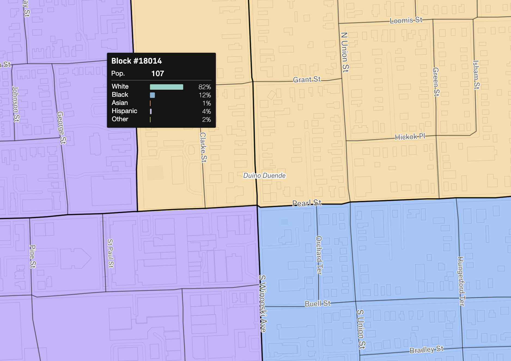

# Vermont redistricting 2020
Data processing for the 2020 redistricting cycle in Vermont

## Block correspondence files

Usable in both [Districtbuilder](https://www.districtbuilder.org/) and [Districtr](https://districtr.org/) (where [a good example file is provided](https://districtr.org/assets/import-export-examples/districting/assignment-ec0a7f81.csv)), block correspondence files are tables that show membership of each census block within a parent unit; in this case Legislative House and Senate districts for Vermont, as well as Wards and Districts for the city of Burlington.

### Data acquisition
[VCGI](https://vcgi.vermont.gov/) has provided up-to-date boundaries for the legislative districts [here](https://drive.google.com/drive/folders/1TSMJ5Xv2MaqENmzMa_43pxnNA1ce6HGm) (enriched with the 2020 census data). And while the city of Burlington [provides excellent graphics](https://www.burlingtonvt.gov/sites/default/files/CT/ElectionMaps/burlington_vermont_city_wards_2015_24x36.pdf), the geodata behind them will have to be retrieved from [the participatory archives of 2013](https://www.dropbox.com/s/z21tn0nc0oe4iql/btv_ward_stats_2018.geojson?dl=0).

Meanwhile, the census provides TIGER data (boundary files) for census blocks of both the 2010 and 2020 vintages [here](https://www.census.gov/geographies/mapping-files/time-series/geo/tiger-line-file.html). _Note that there are differences in block boundaries between the two vintages! We'll have to produce correspondence files for each to be comprehensive.

Lacking direct links to some of the above, we'll assume manual download and placement in a `data/` directory. Five datasets in all:

1. Census blocks 2010
2. Census blocks 2020 (packaged in the same geodatabase as item 1)
3. VT state Senate districts
4. VT state House districts
5. Burlington city Wards

### Database configuration
Let's PostGIS this situation.

```sh
# Make the DB
createdb vt_districts_2020
# Enable PostGIS
psql vt_districts_2020 -c "CREATE EXTENSION postgis"
```

### Data ingestion
Because some area calculations are going to be used, we'll standardize on the Vermont State Plane projection (EPSG:32145), and use the [OGR2OGR geospatial Swiss army knife](https://gdal.org/) to import the data.

```
# Census blocks 2010
ogr2ogr -t_srs "EPSG:32145" -f "PostgreSQL" PG:"host=localhost dbname=vt_districts_2020" data/tlgdb_2020_a_50_vt.gdb/ Block10 -nln block10 -nlt PROMOTE_TO_MULTI
# Census blocks 2020
ogr2ogr -t_srs "EPSG:32145" -f "PostgreSQL" PG:"host=localhost dbname=vt_districts_2020" data/tlgdb_2020_a_50_vt.gdb/ Block20 -nln block20 -nlt PROMOTE_TO_MULTI
# VT state Senate districts
ogr2ogr -t_srs "EPSG:32145" -f "PostgreSQL" PG:"host=localhost dbname=vt_districts_2020" -sql "SELECT sldust20,geoid20,namelsad20,members,ideal_valu,POP100,deviation,per_dev FROM vt_senate_2020_enriched" data/vt_senate_2020_enriched/vt_senate_2020_enriched.shp -nln vt_senate_2020 -nlt PROMOTE_TO_MULTI
# VT state House districts
ogr2ogr -t_srs "EPSG:32145" -f "PostgreSQL" PG:"host=localhost dbname=vt_districts_2020" -sql "SELECT sldlst20,geoid20,namelsad20,members,ideal_valu,POP100,deviation,perc_dev AS per_dev FROM vt_house_2020_enriched" data/vt_house_2020_enriched/vt_house_2020_enriched.shp -nln vt_house_2020 -nlt PROMOTE_TO_MULTI
# Burlington wards
ogr2ogr -t_srs "EPSG:32145" -f "PostgreSQL" PG:"host=localhost dbname=vt_districts_2020" data/btv_ward_stats_2018.geojson -nln btv_wards_2018 -nlt PROMOTE_TO_MULTI
```

### Correspondence file generation
There are two vintages and three sets of districts, so that'll be 6 correspondence files. let's tackle them by vintage.

#### 2010

```sh
# Senate
psql vt_districts_2020 -c "\\copy (
  SELECT
    block10.geoid AS block_id,
    vt_senate_2020.ogc_fid AS assignment
  FROM vt_senate_2020
  JOIN block10 ON ST_Intersects(ST_Centroid(block10.shape), vt_senate_2020.wkb_geometry)
) TO STDOUT CSV HEADER" > correspondence/vt_senate_2010.csv

# House
psql vt_districts_2020 -c "\\copy (
  SELECT
    block10.geoid AS block_id,
    vt_house_2020.ogc_fid AS assignment
  FROM vt_house_2020
  JOIN block10 ON ST_Intersects(ST_Centroid(block10.shape), vt_house_2020.wkb_geometry)
) TO STDOUT CSV HEADER" > correspondence/vt_house_2010.csv

# City
psql vt_districts_2020 -c "\\copy (
  SELECT
    block10.geoid AS block_id,
    btv_wards_2018.ward_assig AS assignment
  FROM btv_wards_2018
  JOIN block10 ON ST_Intersects(ST_Centroid(block10.shape), btv_wards_2018.wkb_geometry)
    AND ST_Area(ST_Intersection(block10.shape, btv_wards_2018.wkb_geometry)) > (ST_Area(block10.shape) / 2)
) TO STDOUT CSV HEADER" > correspondence/btv_wards_2010.csv
```

#### 2020
```sh
# Senate
psql vt_districts_2020 -c "\\copy (
  SELECT
    block20.geoid AS block_id,
    vt_senate_2020.ogc_fid AS assignment
  FROM vt_senate_2020
  JOIN block20 ON ST_Intersects(ST_Centroid(block20.shape), vt_senate_2020.wkb_geometry)
) TO STDOUT CSV HEADER" > correspondence/vt_senate_2020.csv

# House
psql vt_districts_2020 -c "\\copy (
  SELECT
    block20.geoid AS block_id,
    vt_house_2020.ogc_fid AS assignment
  FROM vt_house_2020
  JOIN block20 ON ST_Intersects(ST_Centroid(block20.shape), vt_house_2020.wkb_geometry)
) TO STDOUT CSV HEADER" > correspondence/vt_house_2020.csv

# City
psql vt_districts_2020 -c "\\copy (
  SELECT
    block20.geoid AS block_id,
    btv_wards_2018.ward_assig AS assignment
  FROM btv_wards_2018
  JOIN block20 ON ST_Intersects(ST_Centroid(block20.shape), btv_wards_2018.wkb_geometry)
    AND ST_Area(ST_Intersection(block20.shape, btv_wards_2018.wkb_geometry)) > (ST_Area(block20.shape) / 2)
) TO STDOUT CSV HEADER" > correspondence/btv_wards_2020.csv
```

### Play around!
Once uploaded to one of the online tools, [the resulting plans can be shared and evaluated](https://app.districtbuilder.org/projects/4eda3498-b405-44d5-8e37-c37c36563ddc).



## Block statistics
The census has provided block-level statistics in `.pl` file format, including population counts and certain demographic metrics. For ease of use, we can access [pre-transformed](https://redistrictingdatahub.org/wp-content/uploads/2021/08/readme_vt_pl2020_b_csv.txt) data in CSV format from [the Redistricting Data Hub](https://redistrictingdatahub.org/dataset/vermont-block-pl-94171-2020/). These are an important component of overall analyses, so we'll add them to the spatial database above.

### Acquire data

#### 2010
One table at a time download from [the census archives](https://data.census.gov/cedsci/table?q=p3&g=0400000US50.100000&tid=DECENNIALPL2010.P3), then some selection and joining:

```
xsv select "GEO_ID,P001001,P001003,P001004,P001005,P001006,P001007,P001008,P001009" data/DECENNIALPL2010.P1_data_with_overlays_2021-08-17T194626.csv > data/decennial_2010_vt_p1.csv
xsv select "GEO_ID,P002002" data/DECENNIALPL2010.P2_data_with_overlays_2021-08-17T205625.csv > data/decennial_2010_vt_p2.csv
xsv select "GEO_ID,P003001" data/DECENNIALPL2010.P3_data_with_overlays_2021-08-17T205705.csv > data/decennial_2010_vt_p3.csv
xsv select "GEO_ID,H003001,H003002,H003003" data/DECENNIALSF12010.H3_data_with_overlays_2021-08-17T205300.csv > data/decennial_2010_vt_h3.csv
csvjoin -c GEO_ID data/decennial_2010_vt_p1.csv data/decennial_2010_vt_p2.csv data/decennial_2010_vt_p3.csv data/decennial_2010_vt_h3.csv > data/vt_pl2010_b.csv
```

#### 2020
```sh
wget -c https://redistrictingdatahub.org/download/?datasetid=25770&document=%2Fweb_ready_stage%2FPL2020%2Fcsv%2Fvt_pl2020_b.zip
xsv stats data/vt_pl2020_b.csv | xsv select 1-2 | tail -n +2 > data/vt_pl2020_b.sql
# Manually edit the above to a CREATE TABLE statement
```

### Ingest to database

#### 2010
```sh
psql vt_districts_2020 -c "DROP TABLE IF EXISTS vt_94171_2010"
psql vt_districts_2020 -c "CREATE TABLE vt_94171_2010 (
  geo_id text,
  p001001 int,
  p001003 int,
  p001004 int,
  p001005 int,
  p001006 int,
  p001007 int,
  p001008 int,
  p001009 int,
  p002002 int,
  p003001 int,
  h003001 int,
  h003002 int,
  h003003 int
)"
psql vt_districts_2020 -c "\COPY vt_94171_2010 FROM 'data/vt_pl2010_b.csv' CSV HEADER"
```

#### 2020
```sh
psql vt_districts_2020 -c "DROP TABLE IF EXISTS vt_94171_2020"
psql vt_districts_2020 -f data/vt_pl2020_b.sql
psql vt_districts_2020 -c "\COPY vt_94171_2020 FROM 'data/vt_pl2020_b.csv' CSV HEADER"
```

### Join to Block boundaries
```sh
psql vt_districts_2020 -c "DROP TABLE IF EXISTS vt_block_stats_2010"
psql vt_districts_2020 -c "CREATE TABLE vt_block_stats_2010 AS (
  SELECT
    g.geoid,
    s.p001001 AS total_population,
    s.p001003 AS white,
    s.p001004 AS black,
    s.p001005 AS amerindian_alaska_native,
    s.p001006 AS asian,
    s.p001007 AS hawaiian_pacific_islander,
    s.p001008 AS other,
    s.p001009 AS multiracial,
    s.p002002 AS hispanic_latino,
    s.p003001 AS population_over_18,
    s.h003001 AS housing_units,
    s.h003002 AS occupied_units,
    s.h003003 AS vacant_units,
    g.shape AS the_geom
  FROM block10 g
  JOIN vt_94171_2010 s ON replace(s.geo_id,'1000000US','') = g.geoid
)"
```

#### 2020
```sh
psql vt_districts_2020 -c "DROP TABLE IF EXISTS vt_block_stats_2020"
psql vt_districts_2020 -c "CREATE TABLE vt_block_stats_2020 AS (
  SELECT
    g.geoid,
    s.p0010001 AS total_population,
    s.P0010003 AS white,
    s.P0010004 AS black,
    s.P0010005 AS amerindian_alaska_native,
    s.P0010006 AS asian,
    s.P0010007 AS hawaiian_pacific_islander,
    s.P0010008 AS other,
    s.P0010009 AS multiracial,
    s.P0020002 AS hispanic_latino,
    s.P0030001 AS population_over_18,
    s.H0010001 AS housing_units,
    s.H0010002 AS occupied_units,
    s.H0010003 AS vacant_units,
    g.shape AS the_geom
  FROM block20 g
  JOIN vt_94171_2020 s ON s.geocode = g.geoid
)"
```

### Burlington blocks by ward

#### 2010
```
psql vt_districts_2020 -c "DROP TABLE IF EXISTS btv_stats_2010"
psql vt_districts_2020 -c "CREATE TABLE btv_stats_2010 AS (
  SELECT
    v.*,
    w.ward_assig
  FROM vt_block_stats_2010 v
  JOIN btv_wards_2018 w ON
  -- ST_Intersects(ST_Centroid(v.the_geom), w.wkb_geometry) AND
  ST_Area(ST_Intersection(v.the_geom, w.wkb_geometry)) > (ST_Area(v.the_geom) / 2)
)"
```

#### 2020
```
psql vt_districts_2020 -c "DROP TABLE IF EXISTS btv_stats_2020"
psql vt_districts_2020 -c "CREATE TABLE btv_stats_2020 AS (
  SELECT
    v.*,
    w.ward_assig
  FROM vt_block_stats_2020 v
  JOIN btv_wards_2018 w ON
  -- ST_Intersects(ST_Centroid(v.the_geom), w.wkb_geometry) AND
  ST_Area(ST_Intersection(v.the_geom, w.wkb_geometry)) > (ST_Area(v.the_geom) / 2)
)"
```

### Centroids for labeling

#### 2010
```
psql vt_districts_2020 -c "DROP TABLE IF EXISTS btv_stats_2010_centroids"
psql vt_districts_2020 -c "CREATE TABLE btv_stats_2010_centroids AS (
  SELECT
    geoid,
    total_population,
    white,
    black,
    amerindian_alaska_native,
    asian,
    hawaiian_pacific_islander,
    other,
    multiracial,
    hispanic_latino,
    population_over_18,
    housing_units,
    occupied_units,
    vacant_units,
    ward_assig,
    (CASE
      WHEN ST_Intersects(ST_Centroid(the_geom),the_geom) THEN the_geom
      ELSE ST_PointOnSurface(the_geom)
    END) AS the_geom
  FROM btv_stats_2010
)"
```

#### 2020
```
psql vt_districts_2020 -c "DROP TABLE IF EXISTS btv_stats_2020_centroids"
psql vt_districts_2020 -c "CREATE TABLE btv_stats_2020_centroids AS (
  SELECT
    geoid,
    total_population,
    white,
    black,
    amerindian_alaska_native,
    asian,
    hawaiian_pacific_islander,
    other,
    multiracial,
    hispanic_latino,
    population_over_18,
    housing_units,
    occupied_units,
    vacant_units,
    ward_assig,
    (CASE
      WHEN ST_Intersects(ST_Centroid(the_geom),the_geom) THEN the_geom
      ELSE ST_PointOnSurface(the_geom)
    END) AS the_geom
  FROM btv_stats_2020
)"
```

#### Wards
```
psql vt_districts_2020 -c "DROP TABLE IF EXISTS btv_wards_2018_centroids"
psql vt_districts_2020 -c "CREATE TABLE btv_wards_2018_centroids AS (
  SELECT
    ward_assig,
    (CASE
      WHEN ST_Intersects(ST_Centroid(wkb_geometry),wkb_geometry) THEN wkb_geometry
      ELSE ST_PointOnSurface(wkb_geometry)
    END) AS the_geom
  FROM btv_wards_2018
)"
```
