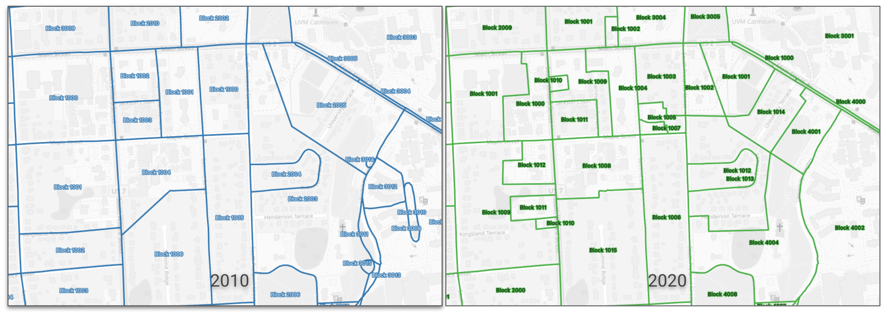

# Correspondence files
The files contained here represent membership of census blocks _within legislative and council districts as of the end of the last reapportionment cycle (2010-2013)_. Files with a `_2010` suffix show membership of the 2010-vintage census blocks, while those with a `_2020` suffix show membership of the latest (2020-vintage) blocks. In many cases there are significant discrepancies between the block vintages, so both are included here.

